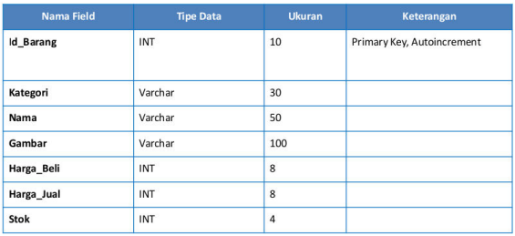

# PEMOGRAMAAN WEB PHP

🔱 Nafal Mumtaz Fuadi (312110457) 🔱

➡️Teknik Informatika - UNIVERSITAS PELITA BANGSA🌈
______________________________________________

## WEB4
---
# <p align="center">Praktikum 4: PHP Modular</p>

### Tujuan
* Mampu memahami konsep dasar Modularisasi Program.
* Mampu memahami konsep dasar Fungsi pada PHP.
* Mampu membuat program Modular sederhana menggunakan PHP.
* Mampu mengimplementasikan penggunaan fungsi pada PHP

### Instruksi Praktikum
* Persiapkan text editor misalnya VSCode.
* Buat folder baru dengan nama lab4_php_database pada docroot webserver (htdocs)
* Ikuti langkah-langkah praktikum yang akan dijelaskan berikutnya.


---
# <p align="center">Langkah-langkah Praktikum</p>
### Buat file baru dengan nama _header.php_
```
<!DOCTYPE html>
<html lang="en">

<head>
    <meta charset="UTF-8">
    <title>Contoh Modularisasi</title>
    <link href="style.css" rel="stylesheet" type="text/stylesheet" media="screen" />
    <style>
        body {
            margin: 0;
            background-color:mintcream;
        }

        nav {
            display: flex;
            justify-content:space-around;
            align-items: center;
            background-color: darkcyan;
            padding: 10px;
            box-shadow:2px 2px 5px 1px;
        }

        .nav-links a {
            color: #fff;
            text-decoration: none;
            margin: 0 10px;
        }


        @media screen and (max-width: 768px) {
            .nav-links {
                display: none;
            }
        }

    </style>
</head>

<body>
    <div>
        <header>
            <h1 align="center">Modularisasi Menggunakan Require</h1>
        </header>
        <nav>
            <div class="nav-links">
                <a href="home.php">Home</a>
                <a href="about.php">About</a>
                <a href="kontak.php">Contact</a>
            </div>
        </nav>
```

### Buat file baru dengan nama _footer.php_
```
<footer align="center" style="background-color:darkcyan; color:white; width:100%; padding:10px; position:absolute; bottom:0px; ">
    <p>&copy; 2023, Informatika, Universitas Pelita Bangsa</p>
</footer>
</div>
</body>

</html>
```

### Buat file baru dengan nama _home.php_
```
<?php require('header.php'); ?>
<div class="content" style="margin-left:20px;">
    <h2>Ini Halaman Home</h2>
    <p>Ini adalah bagian content dari halaman.</p>
</div>
<?php require('footer.php'); ?>
```

### Buat file baru dengan nama _about.php_
```
<?php require('header.php'); ?>
<div class="content" style="margin-left:20px;">
    <h2>Ini Halaman About</h2>
    <p>Ini adalah bagian content dari halaman.</p>
</div>
<?php require('footer.php'); ?>
```

## Membuat Routing
Routing digunakan untuk mempermudah akses halaman web agar SEO Friendly.

Langkah awal adalah menyiapkan file utama (index.php) yang berisi routing untuk mengakses banyak
halaman.

Contohnya:

• Halaman Home ( http://localhost/lab4/index.php?mod=home )

• Halaman About ( http://localhost/lab4/index.php?mod=about )

### Buat file baru dengan nama _index.php_
```
<?php

$mod = isset($_REQUEST['mod']) ? $_REQUEST['mod'] : "home";

switch ($mod) {
    case "home":
        require("home.php");
        break;
    case "about":
        require("about.php");
        break;
    default:
        require("home.php");
}
?>
```

### Aktivasi mod_rewrite (.htaccess)
Mod_rewrite digunakan untuk mengubah URL dari query string menjadi SEO Friendly.

Langkah awal yang harus disiapkan adalah aktivasi mod_rewrite pada webserver Apache2 pada
configurasi httpd.conf.


lalu,


Aktifkan LoadModule mod_rewrite dengan cara melakukan un-comment pada baris tersebut,
kemudian restart Apache2.

### Langkah berikutnya adalah membuat file _.htaccess_
```
<IfModule mod_rewrite.c>
RewriteEngine On
RewriteBase /lab4/
RewriteCond %{REQUEST_FILENAME} !-f
RewriteCond %{REQUEST_FILENAME} !-d
RewriteRule ^(.*)$ index.php?mod=$1 [L]
</IfModule>
```

Cara aksesnya menjadi:

* Halaman Home ( http://localhost/lab4_php_module/home.php )
* Halaman About ( http://localhost/lab4_php_module/about.php )

### Maka Hasilnya,

### Halaman Home

### Halaman About

### Halaman Contact


# <p align="center">Tugas</p>
Implementasikan konsep modularisasi pada kode program praktikum 3 tentang database, sehingga
setiap halamannya memiliki template tampilan yang sama.

## Membuat Database: Studi Kasus Data Barang


>Membuat Tabel

``` CREATE DATABASE latihan1; ```

>Membuat Database

```CREATE TABLE data_barang (
id_barang int(10) auto_increment Primary Key,
kategori varchar(30),
nama varchar(30),
gambar varchar(100),
harga_beli decimal(10,0),
harga_jual decimal(10,0),
stok int(4)
);
```


>Menambahkan Data


## Buat folder baru bernama _Tugas_


### Buat file baru dengan nama _header.php_
```
<!DOCTYPE html>
<html lang="en">

<head>
    <meta charset="UTF-8">
    <title>Modular dengan CRUD</title>
    <link href="style.css" rel="stylesheet" type="text/stylesheet" media="screen" />
    <style>
        body {
            margin: 0;
            background-color:mintcream;
        }

        nav {
            display: flex;
            justify-content:space-around;
            align-items: center;
            background-color: darkcyan;
            padding: 10px;
            box-shadow:2px 2px 5px 1px;
        }

        .nav-links a {
            color: #fff;
            text-decoration: none;
            margin: 0 10px;
        }


        @media screen and (max-width: 768px) {
            .nav-links {
                display: none;
            }
        }

    </style>
</head>

<body>
    <div>
        <header>
            <h1 align="center">Modularisasi dan CRUD</h1>
        </header>
        <nav>
            <div class="nav-links">
                <a href="home.php">Home</a>
                <a href="tambah.php">Tambah</a>
            </div>
        </nav>
```        
   
### Buat file baru dengan nama _footer.php_
```
<footer align="center" 
style="
background-color:darkcyan; 
color:white; 
width:100%; 
padding:10px; 
bottom:0px; ">
    <p>&copy; 2023, Informatika, Universitas Pelita Bangsa</p>
</footer>
</div>
</body>

</html>
```

### Membuat Routing
Routing digunakan untuk mempermudah akses halaman web agar SEO Friendly.

Langkah awal adalah menyiapkan file utama (index.php) yang berisi routing untuk mengakses banyak
halaman.

Contohnya:

• Halaman Home ( http://localhost/lab4/index.php?mod=home )

• Halaman About ( http://localhost/lab4/index.php?mod=about )

### Buat file baru dengan nama _index.php_
```
<?php

$mod = isset($_REQUEST['mod']) ? $_REQUEST['mod'] : "home";

switch ($mod) {
    case "home":
        require("home.php");
        break;
    case "tambah":
        require("tambah.php");
        break;
    default:
        require("home.php");
}
?>
```

### Aktivasi mod_rewrite (.htaccess)
Mod_rewrite digunakan untuk mengubah URL dari query string menjadi SEO Friendly.

Langkah awal yang harus disiapkan adalah aktivasi mod_rewrite pada webserver Apache2 pada
configurasi httpd.conf.


lalu,


Aktifkan LoadModule mod_rewrite dengan cara melakukan un-comment pada baris tersebut,
kemudian restart Apache2.

### Langkah berikutnya adalah membuat file _.htaccess_
```
<IfModule mod_rewrite.c>
RewriteEngine On
RewriteBase /lab4/
RewriteCond %{REQUEST_FILENAME} !-f
RewriteCond %{REQUEST_FILENAME} !-d
RewriteRule ^(.*)$ index.php?mod=$1 [L]
</IfModule>
```

Cara aksesnya menjadi:

* Halaman Home ( http://localhost/lab4_php_module/home.php )
* Halaman About ( http://localhost/lab4_php_module/about.php )

### Buat file baru dengan nama _home.php_
```
<?php require('header.php'); ?>
<?php
include "koneksi.php";

$query = "SELECT * FROM data_barang";
$result = mysqli_query($koneksi, $query);
?>

<!DOCTYPE html>
<html lang="en">
  <head>
    <meta charset="UTF-8" />
    <meta http-equiv="X-UA-Compatible" content="IE=edge" />
    <meta name="viewport" content="width=device-width, initial-scale=1.0" />
    <title>Modular dengan CRUD</title>

    <link
      rel="stylesheet"
      href="https://cdn.jsdelivr.net/npm/bootstrap@5.2.0-beta1/dist/css/bootstrap.min.css"
    />
  </head>

  <body>
    
    <div class="container">
      <h4 class="mt-4">
        <!-- <svg xmlns="http://www.w3.org/2000/svg" width="26" height="26" fill="currentColor" class="bi bi-basket2" viewBox="0 0 16 16">
        <path d="M4 10a1 1 0 0 1 2 0v2a1 1 0 0 1-2 0v-2zm3 0a1 1 0 0 1 2 0v2a1 1 0 0 1-2 0v-2zm3 0a1 1 0 1 1 2 0v2a1 1 0 0 1-2 0v-2z"/>
        <path d="M5.757 1.071a.5.5 0 0 1 .172.686L3.383 6h9.234L10.07 1.757a.5.5 0 1 1 .858-.514L13.783 6H15.5a.5.5 0 0 1 .5.5v1a.5.5 0 0 1-.5.5h-.623l-1.844 6.456a.75.75 0 0 1-.722.544H3.69a.75.75 0 0 1-.722-.544L1.123 8H.5a.5.5 0 0 1-.5-.5v-1A.5.5 0 0 1 .5 6h1.717L5.07 1.243a.5.5 0 0 1 .686-.172zM2.163 8l1.714 6h8.246l1.714-6H2.163z"/>
        </svg> --> Data Barang</h4>
      <a href="tambah.php" class="btn btn-success btn-sm mb-4 float-end">Tambah Barang</a>

      <table class="table table-sm table-bordered">
        <tr class="text-center fw-bold text-uppercase">
          <td>No</td>
          <td>Gambar</td>
          <td>Nama</td>
          <td>Kategori</td>
          <td>Harga Beli</td>
          <td>Harga Jual</td>
          <td>Stok</td>
          <td>Aksi</td>
        </tr>
        <?php
        if ($result->num_rows > 0) { 
          
          // die(); 
          $no = 1; 
          while ($data = mysqli_fetch_array($result)) { 
            // var_dump($data['nama_barang']); 
            ?>
        <tr>
          <td class="text-center"><?= $no++ ?></td>
          <td class="text-center">
            "
              alt="<?= $data['nama'];?>"
              width="100px" />
          </td>
          <td><?= $data['nama'] ?></td>
          <td><?= $data['kategori'] ?></td>
          <td>
            Rp.<?= $data['harga_beli'] ?>
          </td>
          <td>
            Rp.<?= $data['harga_jual'] ?>
          </td>
          <td><?= $data['stok'] ?></td>
          <td class="text-center">
            <a
              href="ubah.php?id_barang=<?= $data['id_barang'] ?>"
              class="btn btn-warning btn-sm mx-1">Edit</a>
            <a
              href="proses.php?id_barang=<?= $data['id_barang'] ?>&aksi=hapus"
              class="btn btn-danger btn-sm mx-1">Delete</a>
          </td>
        </tr>
        <?php
                }
            } else {
                ?>
        <tr>
          <td colspan="8" class="text-center">Data Kosong</td>
        </tr>
        <?php
            }
            ?>
      </table>
    </div>
  </body>
</html>

<?php require('footer.php'); ?>
```

### Buat file baru dengan nama _koneksi.php_
```
<?php
$koneksi = mysqli_connect('localhost', 'root', '', 'latihan1');

if ($koneksi == false) {
    echo "Koneksi gagal";
    die();
} 

// var_dump($koneksi);
```

### Buat file baru dengan nama _proses.php_
```
<?php
include "koneksi.php";

if ($_SERVER["REQUEST_METHOD"] == "POST") {
    // -- Tambah Barang -- 
    if (isset($_POST['tambah'])) {
        $input = (object) $_POST;

        $nama = ucwords(strtolower($input->nama));
        $kategori = ucwords(strtolower($input->kategori));
        $harga_beli = $input->harga_beli;
        $harga_jual = $input->harga_jual;
        $stok = $input->stok;
        $file_gambar = $_FILES['gambar_barang'];
        $gambar = NULL;
        
        if ($file_gambar['error'] == 0) {
            $nama_gambar = str_replace(' ', '_', $file_gambar['name']);
            $path = dirname(__FILE__) . '/gambar/' . $nama_gambar;

            if (move_uploaded_file($file_gambar['tmp_name'], $path)) {
                $gambar = $nama_gambar;
            }
        }
        
        $query = "INSERT INTO data_barang (nama, kategori, harga_beli, harga_jual, stok, gambar) ";
        $query .= "VALUE ('$nama', '$kategori', '$harga_beli', '$harga_jual', '$stok', '$gambar') ";
        
        $result = mysqli_query($koneksi,$query);
        
        header('location:index.php');

        // -- Ubah Barang -- 
    } else if (isset($_POST['ubah'])) {
        $input = (object) $_POST;
        
        $nama = ucwords(strtolower($input->nama));
        $kategori = ucwords(strtolower($input->kategori));
        $harga_beli = $input->harga_beli;
        $harga_jual = $input->harga_jual;
        $stok = $input->stok;
        $file_gambar = $_FILES['gambar_barang'];
        $gambar = NULL;

        if ($file_gambar['error'] == 0) {
            $nama_gambar = str_replace(' ', '_', $file_gambar['name']);
            $path = dirname(__FILE__) . '/gambar/' . $nama_gambar;

            if (move_uploaded_file($file_gambar['tmp_name'], $path)) {
                $gambar = $nama_gambar;
            }
        }
        
        $query = "UPDATE data_barang SET nama = '$nama', kategori = '$kategori', harga_beli = '$harga_beli', harga_jual = '$harga_jual', stok = '$stok'";

        if (!empty($gambar)) {
            $query .= ", gambar = '$gambar' ";
        }
        $query .= "WHERE id_barang = $input->id_barang"; 
        $result = mysqli_query($koneksi, $query);
        
        header('location:index.php');
    }

    // -- Hapus barang --
} else if (isset($_GET['id_barang']) && $_GET['aksi'] == "hapus") {

    $id = $_GET['id_barang'];
    $query = "DELETE FROM data_barang WHERE id_barang = $id";

    $result = mysqli_query($koneksi, $query);

    header('location:index.php');
}
```
### Buat file baru dengan nama _tambah.php_
```
<?php require('header.php'); ?>
<!DOCTYPE html>
<html lang="en">
  <head>
    <meta charset="UTF-8" />
    <meta http-equiv="X-UA-Compatible" content="IE=edge" />
    <meta name="viewport" content="width=device-width, initial-scale=1.0" />
    <title>CRUD Sederhana</title>
    <link
      rel="stylesheet"
      href="https://cdn.jsdelivr.net/npm/bootstrap@5.2.0-beta1/dist/css/bootstrap.min.css"/>
  </head>
  <body>
    <div class="container">
      <div class="row m-0">
        <div class="col-md-5 mx-auto">
          <div class="card mt-3">
            <div class="card-header text-center">
              <h3>Tambah Barang</h3>
            </div>
            <div class="card-body">
              <form
                action="proses.php"
                method="post"
                enctype="multipart/form-data">
                <div class="mb-3">
                  <label for="nama" class="form-label">Nama Barang</label>
                  <input
                    type="text"
                    name="nama"
                    id="nama"
                    placeholder="Masukan nama barang"
                    class="form-control"/>
                </div>
                <div class="mb-3">
                  <label for="kategori" class="form-label">Kategori Barang</label>
                  <input
                    type="text"
                    name="kategori"
                    id="kategori"
                    placeholder="Masukan kategori barang"
                    class="form-control"/>
                </div>

                <label for="harga_beli" class="form-label">Harga Beli</label>
                <div class="input-group mb-3">
                  <span class="input-group-text">Rp.</span>
                  <input
                    type="number"
                    name="harga_beli"
                    id="harga_beli"
                    placeholder="Masukan Harga Beli"
                    class="form-control"/>
                </div>

                <label for="harga_jual" class="form-label">Harga Jual</label>
                <div class="input-group mb-3">
                  <span class="input-group-text">Rp.</span>
                  <input
                    type="number"
                    name="harga_jual"
                    id="harga_jual"
                    placeholder="Masukan Harga Jual"
                    class="form-control"/>
                </div>

                <div class="mb-3">
                  <label for="stok" class="form-label">Stok</label>
                  <input
                    type="number"
                    class="form-control"
                    name="stok"
                    placeholder="Masukan Stok Barang"/>
                </div>

                <div class="mb-3">
                  <label for="gambar" class="form-label">Gambar</label>
                  <input
                    type="file"
                    name="gambar_barang"
                    id="gambar"
                    class="form-control form-control-sm"/>
                </div>

                <a href="index.php" class="btn btn-secondary">Kembali</a>
                <button class="btn btn-success" name="tambah" type="submit">
                  Tambah
                </button>
              </form>
            </div>
          </div>
        </div>
      </div>
    </div>
  </body>
</html>
<?php require('footer.php'); ?>
```
### Buat file baru dengan nama _ubah.php_
```
<?php require('header.php'); ?>
<!DOCTYPE html>
<html lang="en">
  <head>
    <meta charset="UTF-8" />
    <meta http-equiv="X-UA-Compatible" content="IE=edge" />
    <meta name="viewport" content="width=device-width, initial-scale=1.0" />
    <title>CRUD Sederhana</title>
    <link
      rel="stylesheet"
      href="https://cdn.jsdelivr.net/npm/bootstrap@5.2.0-beta1/dist/css/bootstrap.min.css"/>
  </head>
  <body>
    <div class="container">
      <div class="row m-0">
        <div class="col-md-5 mx-auto">
          <div class="card mt-3">
            <div class="card-header text-center">
              <h3>Ubah Barang</h3>
            </div>
            <div class="card-body">
              <?php
                        include "koneksi.php";

                        $id = $_GET['id_barang'];
                        $query = "SELECT * FROM data_barang ";
                        $query .= "WHERE id_barang = $id";

                        $result = mysqli_query($koneksi, $query);
                        $data = mysqli_fetch_array($result);
                        ?>
              <form
                action="proses.php"
                method="post"
                enctype="multipart/form-data">
                <input type="hidden" name="id_barang" value="<?= $id ?>" />
                <div class="mb-3">
                  <label for="nama" class="form-label">Nama Barang</label>
                  <input
                    type="text"
                    name="nama"
                    id="nama"
                    placeholder="Masukan nama barang"
                    class="form-control"
                    value="<?= $data['nama'] ?>"/>
                </div>
                <div class="mb-3">
                  <label for="kategori" class="form-label">Kategori Barang</label>
                  <input
                    type="text"
                    name="kategori"
                    id="kategori"
                    placeholder="Masukan kategori barang"
                    class="form-control"
                    value="<?= $data['kategori']?>"/>
                </div>

                <label for="harga_beli" class="form-label">Harga Beli</label>
                <div class="input-group mb-3">
                  <span class="input-group-text">Rp.</span>
                  <input
                    type="number"
                    name="harga_beli"
                    id="harga_beli"
                    placeholder="Masukan Harga Beli"
                    class="form-control"
                    value="<?= $data['harga_beli']?>"/>
                </div>

                <label for="harga_jual" class="form-label">Harga Jual</label>
                <div class="input-group mb-3">
                  <span class="input-group-text">Rp.</span>
                  <input
                    type="number"
                    name="harga_jual"
                    id="harga_jual"
                    placeholder="Masukan Harga Jual"
                    class="form-control"
                    value="<?= $data['harga_jual']?>"/>
                </div>

                <div class="mb-3">
                  <label for="stok" class="form-label">Stok</label>
                  <input
                    type="number"
                    class="form-control"
                    name="stok"
                    placeholder="Masukan Stok Barang"
                    value="<?= $data['stok']?>"/>
                </div>

                <div class="mb-3">
                  <label for="gambar" class="form-label">Gambar</label>
                  <input
                    type="file"
                    name="gambar"
                    id="gambar"
                    class="form-control form-control-sm"
                    value="<?= $data['gambar']?>"/>
                </div>

                <a href="index.php" class="btn btn-secondary">Kembali</a>
                <button class="btn btn-warning" name="ubah" type="submit">
                  Edit
                </button>
              </form>
            </div>
          </div>
        </div>
      </div>
    </div>
  </body>
</html>
<?php require('footer.php'); ?>
```

# <p align="center">Hasil Tugas</p>

### Tampilan Home


### Tampilan Tambah


### Tampilan Ubah / Edit


---
# <P align="center"> THANK YOU SO MUCH FOR YOUR ATTENTION!! SEE YOU SOON!!

